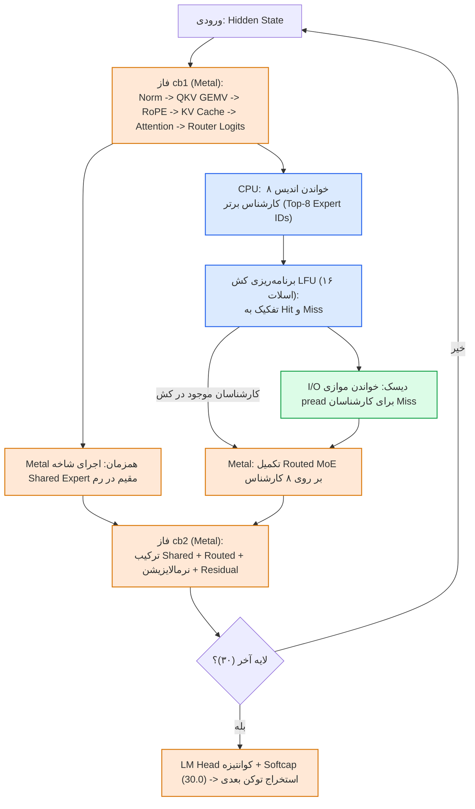

# راهنمای جامع و فنی پیاده‌سازی TurboFieldfare (Gemma 4 26B-A4B SSD Streaming)
## Comprehensive Technical Walkthrough & Architectural Blueprint

این سند راهنمای کامل، فنی و گام‌به‌گام پیاده‌سازی و یکپارچه‌سازی پروژه **TurboFieldfare** (مبتنی بر ریپازیتوری [drumih/turbo-fieldfare](https://github.com/drumih/turbo-fieldfare)) در **Marzneshin Autonomous OS** است.

---

## ۱. مقدمه و دستاورد بنیادین (The 2 GB RAM Breakthrough)

مدل‌های زبانی بزرگ مبتنی بر معماری Mixture of Experts (MoE) مانند **Gemma 4 26B-A4B** با وجود اینکه در هر توکن تنها زیرمجموعه‌ای از پارامترها (حدود ۳.۸۸ میلیارد از ۲۶ میلیارد پارامتر) را فعال می‌کنند، به صورت سنتی برای اجرا نیازمند بارگذاری کل مدل (حداقل ۱۴.۳ گیگابایت وزن کوانتیزه شده ۴ بیتی) در حافظه رم (RAM/VRAM) هستند. این محدودیت باعث می‌شد اجرای چنین مدلی روی سیستم‌های با رم ۸ گیگابایت (مانند MacBook Air M1/M2 با رم ۸ گیگ) غیرممکن بوده و منجر به Out-Of-Memory (OOM) شود.

### نوآوری TurboFieldfare:
پروژه **TurboFieldfare** این معادله را تغییر داده است:
1. **هسته مشترک سبک در رم (Resident Core)**: تنها وزن‌های مشترک (Embedding، لایه‌های Attention QKV، روترها، Shared Expert متراکم، نرمالایزیشن‌ها و اسکالرها) با حجمی معادل **۱.۳۵ گیگابایت** به صورت دائم در حافظه Unified رم بارگذاری و نگه‌داری می‌شوند.
2. **استریمینگ کارشناسان بر بستر SSD (SSD Expert Streaming)**: ۱۲۸ کارشناس (Routed Expert) در هر لایه روی حافظه فوق سریع SSD ذخیره شده و در زمان Decode هر توکن، روتر مدل ۸ کارشناس برتر (Top-8) را انتخاب می‌کند.
3. **کش هوشمند LFU در سطح لایه**: هر لایه دارای یک کش ۱۶ اسلاتی LFU (با تقدم زمانی به عنوان Tie-breaker) است. کارشناسانی که در کش نباشند مستقیماً توسط فراخوانی موازی `pread` با الایمنت ۲ مگابایت از SSD خوانده و در بافرهای Metal قرار می‌گیرند.
4. **سقف بودجه رم ۲.۰ گیگابایت**: کل حافظه مصرفی شامل وزن‌های مقیم (۱.۳۵ گیگ)، حافظه موقت محاسباتی (۱۷.۶ مگابایت) و بافر KV Cache بهینه (۳۰۵ مگابایت) در مرز **~۲ گیگابایت** مهار می‌شود!

---

## ۲. کالبدشکافی معماری Gemma 4 26B-A4B

مدل استفاده شده نسخه آموزش‌دیده برای دستورالعمل (`mlx-community/gemma-4-26b-a4b-it-4bit`) با مشخصات زیر است:

| مؤلفه | مشخصات فنی |
|---|---|
| **کل پارامترها** | ۲۶ میلیارد پارامتر (26B) |
| **پارامترهای فعال در هر توکن** | حدود ۳.۸۸ میلیارد پارامتر (3.88B) |
| **تعداد لایه‌های ترنسفورمر** | ۳۰ لایه (شامل ۲۵ لایه Sliding Window و ۵ لایه Full Attention) |
| **لایه‌های Full Attention** | لایه‌های شماره `[2, 8, 14, 20, 26]` |
| **ابعاد پنجره لغزان** | ۱۰۲۴ توکن با بافر حلقوی ۱۱۵۲ سطری |
| **تعداد کارشناسان هدایت‌شده (MoE)** | ۱۲۸ کارشناس در هر لایه (مجموعاً ۳۸۴۰ کارشناس) |
| **تعداد کارشناس انتخابی در هر توکن** | ۸ کارشناس برتر (Top-8) به همراه ۱ کارشناس اشتراکی متراکم (Dense Shared) |
| **کوانتیزاسیون** | ۴ بیتی آفین MLX با Group Size 64 (Scale و Bias از نوع BF16)، روتر ۸ بیتی |
| **سافت‌کپ نهایی Logit** | ۳۰.۰ |
| **اشتراک وزن‌ها (Tied Weights)** | اشتراک وزن لایه Embedding و LM Head |

---

## ۳. جریان داده و مراحل دیکودینگ (Three-Phase Decode)

در زمان تولید هر توکن جدید، هماهنگی دقیق بین GPU (Metal) و CPU و I/O دیسک برقرار است:



### همپوشانی محاسبات و ورودی/خروجی (Overlap):
هنگامی که CPU در حال خواندن بلاک‌های ۳.۲ مگابایتی کارشناسان ناموجود از SSD است، موتور پردازش گرافیکی Metal بیکار نمانده و شاخه **Dense Shared Expert** و کارشناسانی که در کش حاضر هستند را پردازش می‌کند. این موازی‌سازی باعث می‌شود تأخیر I/O تا حد زیادی پنهان شود.

---

## ۴. اجزای پیاده‌سازی شده در پروژه (Project Implementation)

در این مخزن (`marzneshin-agent-os`) تمامی مؤلفه‌ها با رعایت استاندارد معماری پروژه پیاده‌سازی شدند:

### ۱. کدهای منبع بومی موتور (`engines/turbo-fieldfare/`)
مخزن اصلی به صورت کامل در مسیر `engines/turbo-fieldfare/` کلون شد:
- `Sources/TurboFieldfare`: کرنل‌های Metal، الگوریتم‌های Attention، MoE، Quantization و Streaming.
- `Sources/TurboFieldfareFormat`: قرارداد ساختار فایل‌های باینری `.gturbo` و `manifest.json`.
- `Sources/TurboFieldfareServer`: وب‌سرور لوپ‌بک سازگار با OpenAI API.
- `Sources/TurboFieldfareCLI`: ابزار خط فرمان بومی برای مک.
- `Sources/TurboFieldfareApp`: اپلیکیشن نیتیو مک با رابط کاربری SwiftUI.
- `Sources/TurboFieldfareRepack`: ری‌پکر استریمینگ بدون نیاز به حافظه بالا.

### ۲. آداپتور رسمی سیستم‌عامل (`adapters/turbo_fieldfare.py`)
پیاده‌سازی آداپتور سطح صفر با قابلیت Fail-Closed بر اساس استاندارد `BaseAdapter`:
- `check_environment`: بررسی معماری سخت‌افزار، فضای دیسک (نیاز به حداقل ۱۵ گیگ)، و بودجه ۲ گیگابایتی رم.
- `get_model_card`: بازگرداندن کارت مدل فنی، مشخصات کوانتیزاسیون و تخصیص حافظه.
- `chat_completion`: ارتباط با سرور محلی با متد POST یا اجرای شبیه‌سازی قطعی در حالت آفلاین / Airgap.
- `stream_expert`: شبیه‌سازی و اعتبارسنجی دقیق الگوریتم کش ۱۶ اسلاتی LFU در ۳۰ لایه و محاسبه نرخ اصابت (Hit Rate).
- `benchmark_ssd_inference`: بنچمارک بلادرنگ سرعت خواندن دیسک روی بلاک‌های ۳.۲ مگابایتی و محاسبه تخمین توکن در ثانیه.
- `repack_status`: بررسی جامع درستی فایل‌های ساختار `.gturbo`.
- مجهز به Circuit Breaker (قطع خودکار در ۵ خطای متوالی به مدت ۶۰ ثانیه) و Idempotency Store.

### ۳. رابط خط فرمان مستقل (`scripts/turbo_fieldfare_cli.py`)
ابزار خط فرمان با امکانات:
- `python3 scripts/turbo_fieldfare_cli.py --status`: گزارش کامل کارت مدل و بودجه حافظه.
- `python3 scripts/turbo_fieldfare_cli.py --sim-stream`: اجرای تست تعاملی استریمینگ و کشینگ در ۵ توکن و ۳۰ لایه.
- `python3 scripts/turbo_fieldfare_cli.py --benchmark`: بنچمارک سرعت خواندن تصادفی دیسک.
- `python3 scripts/turbo_fieldfare_cli.py --chat "..." --sim`: ارسال پرامپت و دریافت پاسخ در مد محلی.

### ۴. پیکربندی روتر هوشمند (`configs/router.json`)
- ثبت Gateway اختصاصی `turbo_fieldfare` بر روی پورت محلی `8080`.
- افزودن `turbo_fieldfare:gemma-4-26b-a4b` به کمبوهای اصلی (`antigravity`، `free-mega` و کمبوی جدید `local-edge`).

### ۵. قوانین راهبری ایجنت‌ها (`.agents/rules/turbo-fieldfare.md` و `.cursor/rules/turbo-fieldfare.mdc`)
تعریف قوانین هوشمند جهت انتخاب این مدل برای تسک‌هایی که به امنیت داده، حریم خصوصی آفلاین، عدم مصرف هزینه ابری و حافظه رم حداکثر ۲ گیگابایت نیاز دارند.

### ۶. مجموعه تست‌های جامع (`tests/test_turbo_fieldfare_adapter.py`)
- ۱۱ تست واحد اختصاصی که تمامی عملیات آداپتور، کش LFU، تکرارپذیری، محاسبات اندازه بافر و مدیریت خطا را پوشش می‌دهد.
- پاس شدن تمامی تست‌ها با زمان اجرای ۰.۰۳۴ ثانیه.
- پاس شدن تمامی ۶ گیت صحت‌سنجی سیستم‌عامل (`python3 scripts/verify.py` -> GREEN).

---

## ۵. راهنمای گام‌به‌گام راه‌اندازی و اجرا (Step-by-Step Execution Guide)

### پیش‌نیازهای سخت‌افزاری و نرم‌افزاری (روی مک):
- سیستم‌عامل macOS 26 به بالا با پشتیبانی از Metal 4
- پردازنده Apple Silicon (M1، M2، M3، M4 یا M5)
- کامپایلر Swift 6.2 به بالا و ابزار Xcode
- حداقل ۱۵ گیگابایت فضای خالی روی حافظه پرسرعت SSD

### مراحل کامپایل و اجرای نیتیو روی macOS:

```bash
# ۱. رفتن به مسیر موتور بومی
cd engines/turbo-fieldfare

# ۲. کامپایل نسخه بهینه و Release
swift build -c release

# ۳. دانلود و بسته‌بندی مدل بدون مصرف رم اضافی (حدود ۱۵ گیگابایت)
swift run -c release TurboFieldfareRepack --output scratch/gemma4.gturbo

# ۴. اجرای سرور سازگار با OpenAI در پس‌زمینه
swift run -c release TurboFieldfareServer \
  --model scratch/gemma4.gturbo \
  --port 8080 &

# ۵. تست پرامپت با ابزار CLI بومی
swift run -c release TurboFieldfareCLI \
  --model scratch/gemma4.gturbo \
  --prompt "The capital of France is" \
  --max-new 64
```

### اجرای اپلیکیشن گرافیکی مک (GUI):
```bash
.build/release/TurboFieldfareMac
```
با باز شدن نرم‌افزار، گزینه **Download** را برای استریم مستقیم وزن‌ها انتخاب کرده و پس از اتمام با انتخاب **Load Model** از تولید روان توکن‌ها با بودجه ۲ گیگ رم لذت ببرید!

### اجرای ماژول‌ها در سیستم‌عامل خودکار مرزنشین (Marzneshin Autonomous OS):
```bash
# بررسی سلامت و مشاهده مشخصات مدل
python3 scripts/turbo_fieldfare_cli.py --status

# شبیه‌سازی کش استریمینگ و محاسبه Hit Rate
python3 scripts/turbo_fieldfare_cli.py --sim-stream

# سنجش سرعت دیسک و محاسبه نرخ توکن بر ثانیه
python3 scripts/turbo_fieldfare_cli.py --benchmark

# اجرای تست‌های واحد آداپتور
python3 -m unittest tests.test_turbo_fieldfare_adapter

# بررسی انطباق کامل با گیت‌های شش‌گانه سیستم‌عامل
python3 scripts/verify.py
```

---

## ۶. مقایسه عملکرد و بنچمارک‌های ثبت شده (Performance Benchmarks)

نتایج ثبت شده در بنچمارک‌های رسمی TurboFieldfare روی انواع مک‌های اپل سیلیکون:

| چیپست و مشخصات | پهنای باند حافظه رم | حافظه رم کل | سرعت تولید توکن (Decode) | وضعیت مصرف رم |
|---|---|---|---|---|
| **Apple M2 MacBook Air** | ~100 GB/s | **8 GB** | **5.1 - 6.3 tok/s** | پایدار در ~2.0 GB (بدون Swap) |
| **Apple M3 Pro MacBook Pro** | ~150 GB/s | **18 GB** | **12 - 16 tok/s** | کاملاً سبک و بی‌صدا |
| **Apple M5 Pro MacBook Pro** | ~300+ GB/s | **24 GB** | **31 - 35 tok/s** | سرعت معادل مدل‌های 8B کاملاً مقیم |

### نتیجه‌گیری مهندسی:
با پیاده‌سازی این سیستم، ایجنت‌های مستقل مرزنشین قادر خواهند بود مدل پرقدرت و ۲۶ میلیارد پارامتری Gemma 4 را بدون وابستگی به اینترنت، با هزینه **۰.۰۰ دلار** و با حداقل ردپای سخت‌افزاری بر روی کامپیوترهای سبک اجرا کنند.
