# 🌐 Comprehensive Systems Thinking Map: OpenAI Codex for OSS Integration
## Architecture, Dynamics, Feedback Loops & Leverage Points for Marzneshin Agent OS

> **Framework:** System Dynamics (Forrester / Meadows) & Executable Autonomous Contracts (`BUILD-SPEC.md` v2.0)  
> **Target Program:** OpenAI Codex for Open Source (6 Months ChatGPT Pro, $1M Fund API Credits, Codex Security)  
> **System Boundary:** GitHub CI/CD Remote ⇄ OpenAI Codex Cloud ⇄ Local Marzneshin Multi-Agent Daemon

---

## 1. 🎯 Executive System Purpose & Boundary Definition

The integration of OpenAI Codex into **Marzneshin Agent OS** is not merely an external tool wrapper; it is an **autonomous subsystem** designed to achieve a self-sustaining open-source engineering flywheel. 

### The Fundamental System Dilemma
Open-source maintainers face an asymmetric burden: as a project gains adoption, issue and PR volume scales linearly or exponentially, while human maintainer attention remains strictly finite. This leads to **Maintainer Burnout** and **Ecosystem Decay**.

### The Solution: Autonomous Multi-Agent OS with Two-Key Governance
By integrating OpenAI's Codex for OSS program, Marzneshin Agent OS establishes an autonomous closed-loop lifecycle:
1. **Autonomous Ingestion & Synthesis:** OpenAI Codex handles issue triage, test generation, and surgical patching.
2. **Two-Key Verification Gate:** Invariant proofs (`scripts/verify.py`), raw adversarial reviews (`scripts/review.py`), and cryptographic receipts prevent hallucinated or malicious code from entering production.
3. **Fund-Supported Resource Continuity:** The $1M Codex Open Source Fund provides the API compute credits and ChatGPT Pro access needed to power this loop continuously without developer financial strain.

```
       ┌─────────────────────────────────────────────────────────────┐
       │             OpenAI Codex Cloud Infrastructure               │
       │   • GPT-4o / o3-mini Reasoning Engine                       │
       │   • Codex Security Static & Dynamic Code Auditor            │
       │   • $1M Open Source Fund API Credit Pool                    │
       └──────────────────────────────▲──────────────────────────────┘
                                      │ API / Workflows
                                      ▼
       ┌─────────────────────────────────────────────────────────────┐
       │              GitHub CI/CD Automation Perimeter              │
       │   • .github/workflows/codex-oss-pr-review.yml               │
       │   • .github/workflows/codex-maintainer-automation.yml       │
       │   • Branch Protection & PR Gates                            │
       └──────────────────────────────▲──────────────────────────────┘
                                      │ Git / IPC / MCP
                                      ▼
       ┌─────────────────────────────────────────────────────────────┐
       │             Local Marzneshin Agent OS Core                  │
       │   • scripts/codex_bridge.py (Execution Engine)              │
       │   • scripts/verify.py (Invariant Proof Gate - I3, I11, I15) │
       │   • scripts/review.py (Independent Adversarial Reviewer)    │
       │   • receipts/ (Cryptographic Hash Chain from Genesis)       │
       └─────────────────────────────────────────────────────────────┘
```

---

## 2. 📊 Stock & Flow Modeling (نمودار موجودی و جریان)

In system dynamics, **Stocks** represent the accumulations of value, state, or liabilities in the system, while **Flows** represent the rates of change that increase or decrease those stocks.

### Mathematical Formulation of Key Stocks

$$\frac{dS_{PR}}{dt} = \Phi_{issue\_triage}(S_{issues}) - \Phi_{merge}(S_{PR})$$

$$\frac{dS_{code}}{dt} = \Phi_{merge}(S_{PR}) \cdot Q_{gate} - \Phi_{deprecation}(S_{code})$$

$$\frac{dS_{budget}}{dt} = \Phi_{grant\_inflow} - \Phi_{token\_burn}(S_{PR}, S_{issues})$$

$$\frac{dS_{receipts}}{dt} = \Phi_{merge}(S_{PR}) \cdot \mathbb{I}_{verified}$$

### Stock-Flow Table

| Stock Name (موجودی) | Inflow (نرخ ورود) | Outflow (نرخ خروج) | Regulatory Mechanism |
|---|---|---|---|
| **$S_{issues}$ Issues Backlog** | Community Bug Reports & Watchdog Anomaly Events | Codex Autonomous Issue Triage | Priority queuing, triage deduplication |
| **$S_{PR}$ Pull Requests** | Autonomous PR Generation via `scripts/pr.py` | Two-Key Sign-off & Automated Merge | CI gate verification, test suite |
| **$S_{code}$ Verified Code** | Merged PRs passing Invariants I3, I11, I15 | Technical Debt & Deprecations | Code coverage $>90\%$, clean linting |
| **$S_{budget}$ Token Reserve** | OpenAI Codex OSS Grant & Replenishment | API Token Burn for Inference & Reviews | Codeburn tracking & local fallback (Kimi/Atria) |
| **$S_{receipts}$ Receipt Chain** | Cryptographically signed proofs per task | Compaction / Pruning via `compact.py` | Unbroken SHA256 chain from genesis |

---

## 3. 🔄 Causal Loop Diagrams (حلقه‌های علت و معلولی)

The system behavior is governed by four primary feedback loops: two **Reinforcing Loops (حلقه‌های تقویت‌کننده)** and two **Balancing Loops (حلقه‌های تعادل‌بخش)**.

```mermaid
flowchart TD
    subgraph R1 [R1: The Open-Source Flywheel]
        A[Repository Activity & Stars] -->|Increase| B[Codex OSS Program Eligibility]
        B -->|Grant| C[API Credits & Free ChatGPT Pro]
        C -->|Powers| D[Autonomous PR Throughput]
        D -->|Enhances| A
    end

    subgraph R2 [R2: Self-Healing Maintenance Loop]
        E[Watchdog Anomaly Detection] -->|Triggers| F[Codex Issue Analysis]
        F -->|Generates| G[Surgical Code Patch]
        G -->|Runs| H[Local Test & Simulation Suite]
        H -->|Passes| I[Automatic PR & Merge]
        I -->|Resolves| E
    end

    subgraph B1 [B1: Two-Key Governance & Safety Barrier]
        J[Autonomous Code Changes] -->|Increases Risk| K[Potential Regression or Hallucination]
        K -->|Tested By| L[scripts/verify.py & Adversarial Reviewer]
        L -->|Rejection / Remediation| J
    end

    subgraph B2 [B2: Token Budget & Cost Guardrail]
        M[High Automation Workload] -->|Accelerates| N[Token Burn Rate]
        N -->|Monitored By| O[Codeburn & Watchdog Ledger]
        O -->|Exceeds Threshold| P[Fallback to Local LLM: Kimi K3 / Atria]
        P -->|Reduces| N
    end
```



### Detailed Loop Explanations

#### 🔁 R1: The Open-Source Flywheel (حلقه تقویت‌کننده رشد)
- High-quality commits, automated test coverage, and transparent agent documentation increase GitHub metrics (stars, forks, active issues resolved).
- These metrics provide compelling evidence for OpenAI's Codex for Open Source committee, leading to grant approvals ($500-$2,500/month API credits and 6-12 months ChatGPT Pro).
- The compute influx fuels higher subagent autonomy, driving even faster project evolution.

#### 🔁 R2: Autonomous Self-Healing Loop (حلقه خودترمیمی)
- The Marzneshin Watchdog engine monitors daemon health and state transitions. When an anomaly is detected, it logs an event.
- The Codex Maintainer Automator picks up the event, inspects the codebase using Karpathy guidelines, writes a minimal patch, runs `verify.py`, and opens a PR.

#### ⚖️ B1: Two-Key Governance & Safety Barrier (حلقه تعادل‌بخش امنیت)
- Unchecked AI generation risks compounding errors or introducing security bugs.
- Loop B1 ensures **NO PR IS MERGED** without Two-Key approval:
  1. Author Agent (Codex Automator) produces code and test evidence.
  2. Adversarial Reviewer (Independent Lineage) audits diffs for privilege escalation, secret leakage, and invariant preservation.
  3. `verify.py --chain` guarantees an unbroken cryptographic receipt hash.

#### ⚖️ B2: Token Budget & Local Fallback (حلقه تعادل‌بخش بودجه)
- If OpenAI API quota runs low or rate limits are reached, the Marzneshin Router smoothly diverts tasks to local engines (Kimi K3 on port 8000, Atria Dawn, or FreeLLMAPI), ensuring uninterrupted operations at zero cost.

---

## 4. 🎛️ Leverage Points Analysis (نقاط اهرمی بر اساس نظریه دانلا مدوز)

In *Thinking in Systems*, Donella Meadows identifies 12 leverage points in a system. Below is the mapping for this integration:

| Hierarchy | Leverage Point | Implementation in Marzneshin + Codex OSS |
|---|---|---|
| **Level 1 (Highest)** | **Transcend Paradigms** | Shift from human-centric bottleneck coding to agent-orchestrated self-governing software. |
| **Level 3** | **Goals of the System** | Primary goal is not just writing code, but **provable invariant stability** (I3, I11, I15). |
| **Level 4** | **Power to Change System Structure** | Codex subagents can propose architectural updates via ADRs (Architectural Decision Records) under Two-Key sign-off. |
| **Level 5** | **Rules of the System** | Enforcing the Executable Contract: `verify.py` is an unbypassable gate in CI. |
| **Level 6** | **Information Flows** | Transparent canonical receipts generated for every single commit and posted to PR comments. |
| **Level 7** | **Reinforcing Feedback Loops** | The OSS funding flywheel: verified quality unlocks continuous free compute. |
| **Level 8** | **Balancing Feedback Loops** | Automatic circuit breakers that halt background agents if token budgets or error thresholds are breached. |

---

## 5. 🛡️ Invariant Integrity & Two-Key Verification Architecture

In accordance with `BUILD-SPEC.md` v2.0:
- **Invariant I3 (Cryptographic State Integrity):** Every state change in `state/` must be paired with an immutable journal entry.
- **Invariant I11 (Sim Gate):** No new code reaches production without passing local test discovery and invariant verification.
- **Invariant I15 (Receipt Chain from Genesis):** Every completed task produces a receipt whose `prev_receipt_hash` points to the previous head receipt in `receipts/_chain/`.

Codex PRs are authenticated using this exact standard, ensuring enterprise-grade auditability for open-source software.
