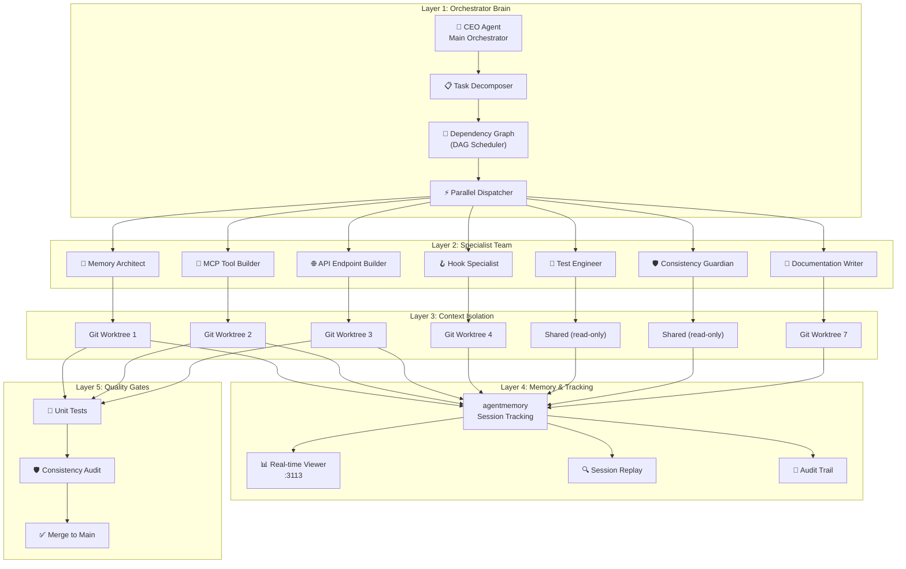

# 🎯 Multi-Agent Orchestrator — Blueprint for agentmemory

> **For Antigravity IDE:** Upload this file to the Antigravity IDE chat. The orchestrator agent will decompose the project into parallel subagent tasks, each running in isolated contexts. Use `/goal` to initiate autonomous execution.

> **For agentic workers:** REQUIRED SUB-SKILL: Use superpowers:subagent-driven-development (recommended) or superpowers:executing-plans to implement this plan task-by-task. Steps use checkbox (`- [ ]`) syntax for tracking.

---

## 🏗️ Architecture Overview

### The CEO Pattern (Hub-and-Spoke)

```
                    ┌──────────────────────┐
                    │   🎩 ORCHESTRATOR    │
                    │   (Main Agent/CEO)    │
                    │                      │
                    │  • Task Decomposition │
                    │  • Dependency Graph   │
                    │  • Result Aggregation │
                    │  • Quality Gates      │
                    │  • Conflict Resolution│
                    └──────────┬───────────┘
                               │
            ┌──────────────────┼──────────────────┐
            │                  │                  │
     ┌──────▼──────┐   ┌──────▼──────┐   ┌──────▼──────┐
     │  🧠 Agent 1 │   │  ⚙️ Agent 2 │   │  🧪 Agent 3 │
     │  Memory     │   │  MCP Tools  │   │  Tests      │
     │  Architect  │   │  Builder    │   │  Engineer   │
     │             │   │             │   │             │
     │ ISOLATED    │   │ ISOLATED    │   │ ISOLATED    │
     │ CONTEXT     │   │ CONTEXT     │   │ CONTEXT     │
     └──────┬──────┘   └──────┬──────┘   └──────┬──────┘
            │                  │                  │
            └──────────────────┼──────────────────┘
                               │
                    ┌──────────▼───────────┐
                    │   📊 RESULT          │
                    │   AGGREGATION        │
                    │   & MERGE            │
                    └──────────────────────┘
```

### Why This Architecture?

| Problem | Solution |
|---------|----------|
| Context window pollution after hours of work | Each subagent gets a fresh, focused context |
| Token waste from old outputs, failed attempts | Subagents only carry task-specific context |
| Single agent bottleneck | Parallel execution across independent tasks |
| No visibility into agent work | agentmemory hooks track every subagent session |
| Merge conflicts from concurrent edits | Dependency graph ensures safe ordering |

---

## 📋 Project Analysis: agentmemory v0.9.29

### Current State

| Metric | Value |
|--------|-------|
| MCP Tools | 54 |
| REST Endpoints | 130 |
| Tests | 1,596+ |
| Hooks | 12 |
| Skills | 17 |
| iii Functions | 260+ |
| Source Files | ~70 TypeScript files |
| Architecture | iii-engine (Worker/Function/Trigger) |

### Existing Orchestration Infrastructure

The project already has a **foundational orchestration layer** in `scripts/orchestrator/`:

- [`orchestrator.ts`](file:///Ubuntu/home/asus/code/marzneshin-agent-os/scripts/orchestrator/orchestrator.ts) — `MainAgentOrchestrator` class with parallel stage execution
- [`task-graph.ts`](file:///Ubuntu/home/asus/code/marzneshin-agent-os/scripts/orchestrator/task-graph.ts) — DAG-based topological sort for dependency resolution
- [`context-isolation.ts`](file:///Ubuntu/home/asus/code/marzneshin-agent-os/scripts/orchestrator/context-isolation.ts) — Git worktree-based isolation manager
- [`consistency-guardian.ts`](file:///Ubuntu/home/asus/code/marzneshin-agent-os/scripts/orchestrator/consistency-guardian.ts) — Cross-file consistency audit (MCP/REST/VERSION)
- [`schemas.ts`](file:///Ubuntu/home/asus/code/marzneshin-agent-os/scripts/orchestrator/schemas.ts) — Type definitions for specialists, tasks, plans

### Existing Superpowers Skills (in `.agents/`)

- `dispatching-parallel-agents` — Pattern for concurrent subagent dispatch
- `subagent-driven-development` — Two-stage implement → review pipeline
- `writing-plans` — Plan decomposition with TDD steps
- `executing-plans` — Checkpoint-based execution

### Existing Hooks for Subagent Tracking

- [`subagent-start.ts`](file:///Ubuntu/home/asus/code/marzneshin-agent-os/src/hooks/subagent-start.ts) — Captures agent_id, agent_type on spawn
- [`subagent-stop.ts`](file:///Ubuntu/home/asus/code/marzneshin-agent-os/src/hooks/subagent-stop.ts) — Captures last_message on completion
- [`antigravity-bridge.ts`](file:///Ubuntu/home/asus/code/marzneshin-agent-os/src/hooks/antigravity-bridge.ts) — Translates Antigravity events to agentmemory hooks

---

## 🗺️ Systems Thinking Map



---

## 🎭 Specialist Agent Definitions

### Agent 1: `@memory-architect`

| Property | Value |
|----------|-------|
| **Role** | Core memory functions, KV schema, search index |
| **Model** | Claude Opus 4.6 (Thinking) |
| **Isolation** | Git worktree |
| **Files** | `src/functions/`, `src/state/`, `src/types.ts` |
| **Depends On** | Nothing (foundation layer) |

**System Prompt:**
```
You are the Memory Architect for the agentmemory project. You work exclusively
on core memory functions (src/functions/), state management (src/state/),
and type definitions (src/types.ts). You understand iii-engine's three
primitives (Worker/Function/Trigger) and never bypass them with standalone
SQLite. Follow the registerFunction pattern from AGENTS.md. Use
fingerprintId() for content-addressable dedup, generateId() for unique IDs.
Record audit via recordAudit() for state-changing operations. TypeScript ESM
only. No comments explaining WHAT code does.
```

---

### Agent 2: `@mcp-tool-builder`

| Property | Value |
|----------|-------|
| **Role** | MCP tool definitions, server dispatch, tool registry |
| **Model** | Claude Sonnet 4.5 |
| **Isolation** | Git worktree |
| **Files** | `src/mcp/tools-registry.ts`, `src/mcp/server.ts` |
| **Depends On** | `@memory-architect` (needs function signatures) |

**System Prompt:**
```
You are the MCP Tool Builder. You add/modify MCP tools in
src/mcp/tools-registry.ts and their handler cases in src/mcp/server.ts.
Every new tool MUST be added to getAllTools() array in tools-registry.ts
AND have a case in the switch statement in server.ts. Validate args with
typeof checks. Parse CSV args with .split(",").map(t => t.trim()).filter(Boolean).
Return { status_code: 200, body: { content: [{ type: "text", text: ... }] } }.
```

---

### Agent 3: `@api-endpoint-builder`

| Property | Value |
|----------|-------|
| **Role** | REST API triggers, auth guards, rate limiting |
| **Model** | Claude Sonnet 4.5 |
| **Isolation** | Git worktree |
| **Files** | `src/triggers/api.ts`, `src/index.ts` |
| **Depends On** | `@memory-architect` (needs function signatures) |

**System Prompt:**
```
You are the API Endpoint Builder. You create REST endpoints in
src/triggers/api.ts following the registerFunction + registerTrigger pattern.
Every endpoint MUST have checkAuth(req, secret), whitelist fields (never pass
raw body to sdk.trigger), and update the endpoint count in src/index.ts
log line. Use api_path: "/agentmemory/your-path" format.
```

---

### Agent 4: `@hook-specialist`

| Property | Value |
|----------|-------|
| **Role** | Hook scripts, antigravity bridge, telemetry |
| **Model** | Claude Sonnet 4.5 |
| **Isolation** | Git worktree |
| **Files** | `src/hooks/`, `src/hooks/antigravity-bridge.ts` |
| **Depends On** | `@api-endpoint-builder` (hooks POST to REST API) |

**System Prompt:**
```
You are the Hook Specialist. You work on src/hooks/ — standalone Node.js
scripts that read JSON from stdin and POST to the REST API. Two patterns:
Context-injecting hooks (pre-tool-use, pre-compact, session-start) use
try/catch with await fetch + AbortSignal.timeout. Telemetry-only hooks
use fire-and-forget fetch paired with setTimeout(() => process.exit(0), 500).unref().
Never import iii-sdk in hook scripts.
```

---

### Agent 5: `@test-engineer`

| Property | Value |
|----------|-------|
| **Role** | Unit tests, integration tests, test infrastructure |
| **Model** | Claude Sonnet 4.5 |
| **Isolation** | Direct (reads all, writes only test/) |
| **Files** | `test/`, `vitest.config.ts` |
| **Depends On** | All other agents (tests validate their work) |

**System Prompt:**
```
You are the Test Engineer. You write and maintain tests in test/ using
vitest. Mock pattern: vi.mock("iii-sdk") with mock sdk.trigger, kv.get/set/list.
Follow existing patterns in test/crystallize.test.ts. All tests must pass
before completing work (npm test). Test files use .test.ts extension.
Current baseline: 1,596+ tests.
```

---

### Agent 6: `@consistency-guardian`

| Property | Value |
|----------|-------|
| **Role** | Cross-file consistency audit, version sync |
| **Model** | Claude Haiku (fast, read-only) |
| **Isolation** | Direct (read-only) |
| **Files** | All (reads only), `scripts/orchestrator/consistency-guardian.ts` |
| **Depends On** | All other agents (runs after all modifications) |

**System Prompt:**
```
You are the Consistency Guardian. You run the consistency audit defined in
scripts/orchestrator/consistency-guardian.ts. You verify: (1) VERSION constant
matches package.json across 7 files, (2) All 54 MCP tools have switch cases
in server.ts, (3) README/AGENTS.md report correct tool and endpoint counts,
(4) test/tool-count-consistency.test.ts asserts exact tool count.
You NEVER modify source code — you only report discrepancies.
```

---

### Agent 7: `@documentation-writer`

| Property | Value |
|----------|-------|
| **Role** | README, AGENTS.md, CHANGELOG, inline docs |
| **Model** | Claude Sonnet 4.5 |
| **Isolation** | Git worktree |
| **Files** | `README.md`, `AGENTS.md`, `CHANGELOG.md`, `docs/` |
| **Depends On** | `@consistency-guardian` (needs final counts) |

---

## 🔄 Execution Flow in Antigravity IDE

### Step 1: Upload & Initialize

```markdown
Upload this file to Antigravity IDE chat, then say:

"Execute this Multi-Agent Orchestration Blueprint using
subagent-driven-development. Dispatch specialist agents
in parallel according to the dependency graph. Track all
subagent sessions in agentmemory for real-time monitoring."
```

### Step 2: Orchestrator Decomposes Tasks

The main agent (CEO) reads this blueprint and:

1. Creates a `task.md` artifact tracking all tasks
2. Identifies which tasks can run in parallel (Stage analysis from DAG)
3. Dispatches subagents using `invoke_subagent` with `TypeName: "self"`

### Step 3: Parallel Stage Execution

```
Stage 1 (Parallel — no dependencies):
  ├── @memory-architect  → Core functions & types
  ├── @documentation-writer → README structure updates
  └── (foundation work)

Stage 2 (Parallel — depends on Stage 1):
  ├── @mcp-tool-builder → New MCP tools
  ├── @api-endpoint-builder → New REST endpoints
  └── @hook-specialist → Hook modifications

Stage 3 (Sequential — depends on Stage 2):
  └── @test-engineer → Write/update tests for all changes

Stage 4 (Sequential — final gate):
  └── @consistency-guardian → Audit all 15 consistency layers
```

### Step 4: Human Tracking

You can monitor all subagent activity in real-time through:

1. **agentmemory Viewer** at `http://localhost:3113` — see sessions, observations, and timelines
2. **Antigravity Agent Manager** — `/agents` panel shows live status of all dispatched subagents
3. **Conversation Transcripts** — each subagent's full conversation is stored at:
   ```
   <appDataDir>/brain/<conversation-id>/.system_generated/logs/transcript.jsonl
   ```
4. **agentmemory Session API** — `memory_sessions` tool lists all active/completed sessions

---

## 📐 Detailed Task Breakdown

### TASK-01: Verify & Harden Core Memory Functions
**Specialist:** `@memory-architect`
**Isolation:** worktree
**Priority:** P0 (Foundation)

- [ ] Audit all `src/functions/*.ts` for missing audit entries
- [ ] Verify `src/state/schema.ts` KV scopes match `src/types.ts` interfaces
- [ ] Check `fingerprintId()` usage consistency across all functions
- [ ] Validate vector index dimension handling in `src/state/vector-index.ts`
- [ ] Ensure all state-changing functions call `recordAudit()`
- [ ] Run: `npm test -- --grep "memory"` to validate

---

### TASK-02: MCP Tools Audit & Enhancement
**Specialist:** `@mcp-tool-builder`
**Isolation:** worktree
**Depends On:** TASK-01

- [ ] Verify all 54 tools in `getAllTools()` have matching `case` in `server.ts`
- [ ] Check input validation in each tool handler
- [ ] Ensure CSV parsing uses `.split(",").map(t => t.trim()).filter(Boolean)`
- [ ] Validate return format `{ content: [{ type: "text", text: ... }] }`
- [ ] Run: `npm test -- --grep "mcp"`

---

### TASK-03: REST API Endpoint Verification
**Specialist:** `@api-endpoint-builder`
**Isolation:** worktree
**Depends On:** TASK-01

- [ ] Verify all 130 endpoints have `checkAuth(req, secret)`
- [ ] Check field whitelisting (no raw body passthrough)
- [ ] Validate `api_path` format consistency
- [ ] Ensure `src/index.ts` log line reports correct endpoint count
- [ ] Run: `npm test -- --grep "api"`

---

### TASK-04: Hook System Hardening
**Specialist:** `@hook-specialist`
**Isolation:** worktree
**Depends On:** TASK-03

- [ ] Verify all 12 hooks follow correct pattern (context-injecting vs telemetry-only)
- [ ] Check `antigravity-bridge.ts` event mapping completeness
- [ ] Validate timeout values (TIMEOUT_MS) across hooks
- [ ] Ensure no hook imports `iii-sdk`
- [ ] Test fire-and-forget pattern with `setTimeout().unref()`

---

### TASK-05: Comprehensive Test Suite
**Specialist:** `@test-engineer`
**Isolation:** direct
**Depends On:** TASK-01, TASK-02, TASK-03, TASK-04

- [ ] Run full suite: `npm test` — verify 1,596+ tests pass
- [ ] Check test coverage for new/modified functions
- [ ] Validate mock patterns use `vi.mock("iii-sdk")`
- [ ] Ensure `test/tool-count-consistency.test.ts` asserts correct count
- [ ] Run: `npm test` with zero failures

---

### TASK-06: Cross-Project Consistency Audit
**Specialist:** `@consistency-guardian`
**Isolation:** direct (read-only)
**Depends On:** TASK-05

- [ ] Run: `npm run consistency:check`
- [ ] Verify VERSION across 7 files matches `package.json`
- [ ] Verify MCP tool count in README, AGENTS.md, test assertions
- [ ] Verify REST endpoint count in README, AGENTS.md, index.ts
- [ ] Report any discrepancies for resolution

---

### TASK-07: Documentation Sync
**Specialist:** `@documentation-writer`
**Isolation:** worktree
**Depends On:** TASK-06

- [ ] Update README.md with current stats (tools, endpoints, tests)
- [ ] Update AGENTS.md "Current Stats" section
- [ ] Update CHANGELOG.md with any changes
- [ ] Verify all file links in docs are valid

---

## 🔧 How to Use This in Antigravity IDE

### Method 1: Direct Upload (Recommended)

1. Open Antigravity IDE
2. Upload this file to the chat
3. Say: **"Execute this blueprint using subagent-driven-development with parallel dispatch"**
4. The orchestrator will:
   - Parse the task dependency graph
   - Dispatch specialist subagents in parallel stages
   - Track progress via task artifact
   - Run consistency audit as final gate

### Method 2: `/goal` Command

```
/goal Execute the Multi-Agent Orchestration Blueprint at
multi-agent-orchestrator-blueprint.md — dispatch all 7 specialist
agents according to the dependency graph, run tests, and ensure
consistency audit passes. Do not stop until all tasks complete.
```

### Method 3: CLI Orchestrator

```bash
npm run orchestrate
```

This runs `scripts/orchestrator/index.ts` which uses the existing `MainAgentOrchestrator` class.

---

## 👁️ Real-Time Monitoring & Tracking

### Tracking Subagent Sessions

Every subagent's work is captured by agentmemory's hook system:

```
subagent-start.ts → POST /agentmemory/observe (hookType: "subagent_start")
subagent-stop.ts  → POST /agentmemory/observe (hookType: "subagent_stop")
```

### Viewing Active Sessions

```bash
# Via REST API
curl http://localhost:3111/agentmemory/sessions

# Via MCP tool
memory_sessions
```

### Session Replay

The real-time viewer at `http://localhost:3113` provides:
- Timeline view of all observations
- Per-session drill-down
- File modification tracking
- Decision and discovery highlighting

### Conversation Transcripts

Each subagent's full conversation is stored at:
```
<appDataDir>/brain/<conversation-id>/.system_generated/logs/transcript.jsonl
```

View with:
```bash
# Find all subagent dispatches
grep "invoke_subagent" transcript.jsonl

# View specific steps
head -n 50 transcript.jsonl | python -m json.tool
```

---

## ⚡ Context Window Optimization

### The Problem

| Session Duration | Typical Context Size | Token Cost |
|-----------------|---------------------|------------|
| 30 minutes | ~50K tokens | Low |
| 2 hours | ~200K tokens | Medium |
| 4+ hours | ~500K+ tokens | **Critical** |

### The Solution: Isolated Subagent Contexts

| Agent | Context Contents | Approx. Size |
|-------|-----------------|-------------- |
| @memory-architect | AGENTS.md + src/functions/ + src/state/ + src/types.ts | ~30K |
| @mcp-tool-builder | AGENTS.md + src/mcp/ + task brief | ~20K |
| @api-endpoint-builder | AGENTS.md + src/triggers/ + src/index.ts | ~25K |
| @hook-specialist | AGENTS.md + src/hooks/ + task brief | ~20K |
| @test-engineer | AGENTS.md + test/ + vitest.config.ts | ~35K |
| @consistency-guardian | All source (read-only scan) | ~15K |

**Total parallel context:** ~145K tokens spread across 6 agents
**vs. Single agent sequential:** 500K+ tokens in one polluted context

**Token savings: ~70-80%** per agent session.

---

## 🛡️ Safety Mechanisms

### 1. Dependency Graph Enforcement
Tasks with `dependsOn` constraints never execute until prerequisites complete.

### 2. Git Worktree Isolation
Each agent works in its own git worktree branch:
```
/tmp/agentmemory-worktrees/
  ├── memory-architect-1695477600/
  ├── mcp-tool-builder-1695477601/
  ├── api-endpoint-builder-1695477602/
  └── hook-specialist-1695477603/
```

### 3. Consistency Guardian Gate
No merge to main until `npm run consistency:check` passes all 15 layers.

### 4. Circuit Breaker
If any stage fails, the orchestrator halts and reports:
```
Stage N failed. Triggering circuit breaker.
```

### 5. Two-Stage Review
From `subagent-driven-development`:
1. Implementer writes code + tests
2. Separate reviewer validates against spec
3. Fix rounds capped at 5 with adjudication

---

## 📊 Expected Outcomes

| Metric | Before | After |
|--------|--------|-------|
| Context per agent | 500K+ (polluted) | ~25K (focused) |
| Token cost per task | High (redundant context) | Low (minimal context) |
| Parallel throughput | 1 task at a time | 3-4 tasks simultaneously |
| Visibility into agent work | Limited | Full session replay |
| Consistency across files | Manual | Automated 15-layer audit |
| Time to complete project | Hours (sequential) | Minutes (parallel) |

---

## 🔑 Key Principles

1. **The Orchestrator is the CEO** — it decomposes, delegates, and decides. It never implements.
2. **Subagents are Specialists** — each has a narrow scope, specific files, and clear deliverables.
3. **Contexts are Isolated** — no subagent inherits another's history or failed attempts.
4. **All Communication Through the Hub** — subagents never talk to each other directly.
5. **agentmemory Tracks Everything** — hooks capture every subagent start/stop for replay.
6. **Quality Gates are Non-Negotiable** — consistency audit is the final merge gate.
7. **Human-in-the-Loop** — you can inspect any subagent's session at any time via viewer/transcripts.

---

## 🚀 Quick Start

```
1. Upload this file to Antigravity IDE
2. Say: "Execute this blueprint with parallel subagent dispatch"
3. Monitor at http://localhost:3113 (agentmemory viewer)
4. Review results when orchestrator reports completion
```

---

> **Inspired by:** The Agency (250+ specialist agents with orchestrator pattern), Ruflo/Claude Flow (multi-agent orchestration with shared memory), and Antigravity IDE's native `invoke_subagent` with `TypeName: "self"` pattern.

> **Built on:** agentmemory's existing `scripts/orchestrator/` infrastructure, Superpowers `dispatching-parallel-agents` and `subagent-driven-development` skills, and the `subagent-start`/`subagent-stop` hook telemetry pipeline.
